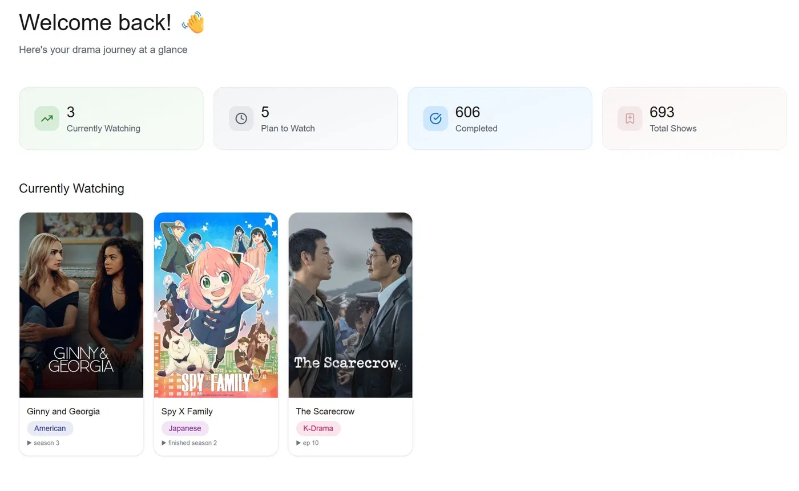
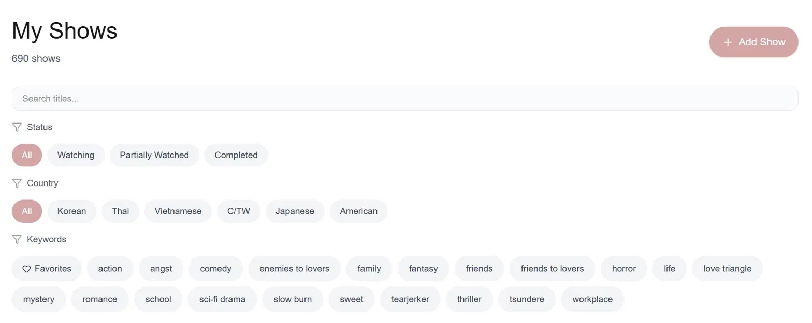
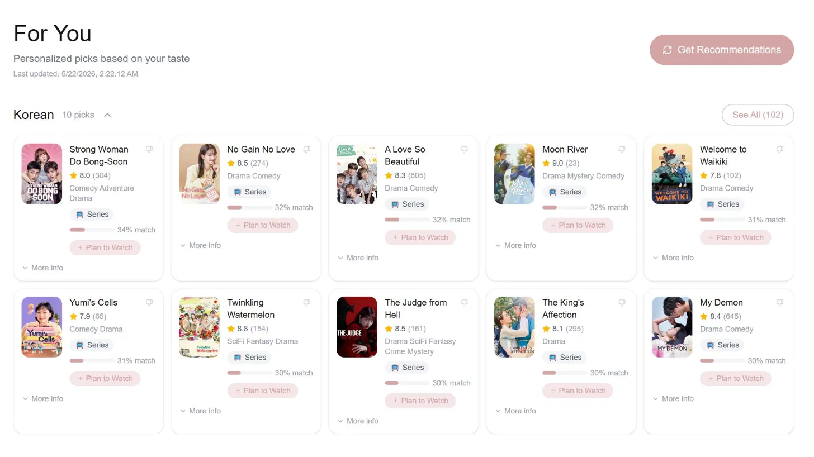

# DramaTracker 🎬

A full-stack solo project featuring multi-user auth, a reading list, TMDB-powered keyword tagging, and a custom Python ML recommendation engine that learns from your watch history.

**Live:** [drama-tracker-3za2.vercel.app](https://drama-tracker-3za2.vercel.app)

---

## Screenshots





---

## Features

**Show Tracking**
- Add shows from 6 countries: Korean, Thai, Vietnamese, Chinese/Taiwanese, Japanese, American
- Track watch status: Currently Watching, Completed, Partially Watched, Plan to Watch
- Star ratings, notes, favorites
- TMDB integration for searching for shows and auto-filling poster, synopsis, and type

**Reading List**
- Track books with categories, reading status, and chapter progress
- User-managed categories with inline collapsible panel

**Keywords System**
- TMDB-based keyword tagging (enemies to lovers, slow burn, romance, etc.)
- Color-coded keyword chips with custom color picker
- Filter your show list by one or more keywords

**AI Recommendations**
- Hybrid ML system - personalized picks per country
- Builds a taste profile from your completed shows
- Ranks by TF-IDF cosine similarity + TMDB rating + weighted keyword match
- Background job system - runs in the background, polls every 10 seconds
- Results cached in database - instant load on repeat visits
- "Not for me" dismiss shows permanently, restore anytime
- "See All" modal with sort options (Best Match, Similarity, Rating)

**Auth**
- Email + password registration with PIN-based email verification
- Multi-user support with full data isolation

---

## Tech Stack

| Layer | Tech |
|---|---|
| Framework | Next.js 16 (App Router) |
| Language | TypeScript |
| Styling | Tailwind CSS |
| Database | PostgreSQL on Neon |
| Auth | NextAuth v5 beta, bcryptjs |
| Email | Nodemailer + Gmail SMTP |
| ML | Python — pandas, scikit-learn |
| Data | TMDB API |
| Deployment | Vercel |

---

## How the Recommendation System Works

```
Your completed shows
        ↓
Build a taste profile per country
(top keywords, favorite type, seed shows, keyword weights)
        ↓
Find new show candidates via TMDB
  Large countries (KR/TH/JP/US): seed-based recommendations + keyword discovery
  Small countries (VN/CN): country-wide discover to guarantee correct origin
        ↓
Score each candidate
  50% TF-IDF cosine similarity to your taste profile
  30% TMDB rating
  20% weighted keyword match
        ↓
Top 10 shown per country + all candidates in "See All"
Results cached in DB — dismissed shows excluded from future runs
```

---

## Project Structure

```
src/
├── app/          # Next.js pages + API routes
├── components/   # Reusable UI components
└── lib/          # DB, auth, email helpers

recommendation/   # Python ML system
├── recommend.py        # Main script
├── taste_profile.py    # Builds per-country taste profiles
├── tmdb_fetcher.py     # Fetches TMDB candidates + keyword cache
└── ranker.py           # TF-IDF + cosine similarity ranking
```

---

## Getting Started

Copy `.env.example` to `.env.local` and fill in your values, then install and run:

```bash
npm install
npm run dev
```

The recommendation system requires Python 3.8+:

```bash
cd recommendation
pip install pandas sqlalchemy scikit-learn requests psycopg2-binary python-dotenv
```

---

## What I Learned

This started as a simple list tracker and grew into a multi-user platform with a custom ML recommendation system. Key concepts explored:

- Next.js App Router (server vs client components, route handlers)
- NextAuth v5 with JWT strategy and Edge Runtime constraints
- PostgreSQL schema design and multi-user data isolation
- Background job patterns in Node.js
- TF-IDF vectorization and cosine similarity for content-based filtering
- Vercel deployment with Neon